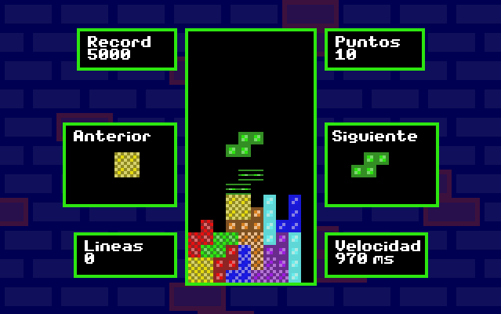
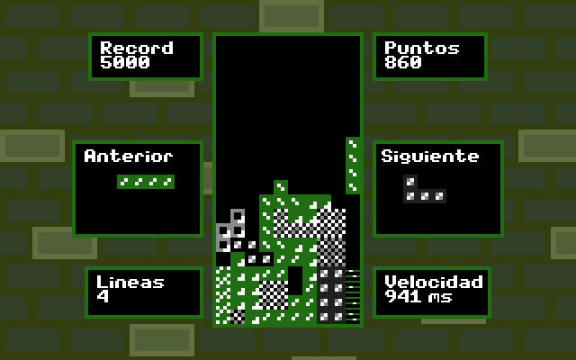
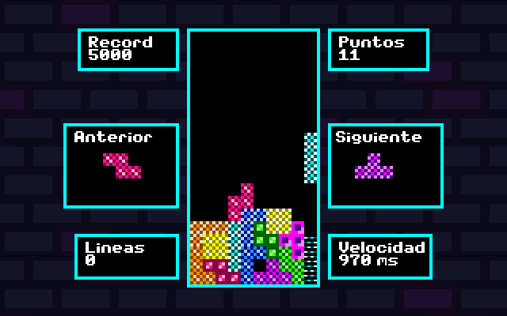

# NODO_TETRIS
Implementación del juego Tetris en C utilizando la biblioteca GBT.

## Requisitos previos
- Compilador: Code::Blocks 25.03 con `mingw-nosetup`
- Librería: [libgbt](https://gitlab.com/RodrigoMaranzana/libgbt-dist)

## Instalación y configuración
1. Descargar este repositorio completo.
2. Descargar `libgbt` y extraer su carpeta `releases` dentro de la carpeta del proyecto.
3. Abrir Code::Blocks y crear un nuevo proyecto de tipo `Console application` en lenguaje `C`.
4. Agregar todos los archivos `.c` y `.h` del proyecto desde el panel del proyecto.
5. Asegurarse de que las opciones `Debug` y `Release` estén marcadas al agregar los archivos.

## Configuración del proyecto en Code::Blocks
1. Hacer clic derecho en el proyecto y seleccionar `Build options`.
2. En la pestaña `Linker`, agregar: `-lGBT -lm`.
3. En `Search directories > Compiler`, agregar:
   - `release\GBT_v2026.1c.01\include\`
4. En `Search directories > Linker`, agregar:
   - `release\GBT_v2026.1c.01\lib\`

## Compilación
- Presionar el botón de compilación en la barra de herramientas.
- Cuando aparezca en la consola el mensaje `Build finished`, el proyecto estará correctamente compilado.

## Instalación y ejecución
- Navegar a la carpeta del proyecto y buscar el archivo `gbt.dll` en `release\GBT_v2026.1c.01\bin\`.
- Copiar `gbt.dll` a la carpeta `bin\debug\` junto con el archivo `.exe` generado.

> El juego ya está listo para ejecutar.

## Configuración del juego
Desde el menú principal se puede acceder a un menú gráfico de configuración.

Parámetros configurables:
- `Dificultad`: fácil, normal y difícil.
- `Resolución`: 320x200 o 640x480.
- `Paleta de colores`: tres estilos visuales.
- `Ancho deluxe`: modifica el tamaño del tablero en modo deluxe.

Botones del menú:
- `Salir`: descarta los cambios.
- `Guardar cambios`: aplica la configuración seleccionada.

### Muestras de paletas de colores
| Clásica | GameBoy | Neon |
|--------|---------|------|
|  |  |  |

`Imágenes tomadas en resolución 320x200 y escala x2`

## Opciones de lanzamiento
El juego acepta argumentos de línea de comandos al ejecutarlo desde CMD.

Para usarlo, abre la terminal en la carpeta donde está el ejecutable y añade los argumentos después del nombre del archivo.
```bash
cd \ruta\al\directorio\del\ejecutable
 tetris.exe -v -2
```

Argumentos disponibles:
- `-v`: inicia el juego en resolución VGA (640x480).
- `-c`: inicia el juego en resolución CGA (320x200).
- `-<N>`: inicia el juego con un multiplicador de escala `N`.

> Ejemplo: `tetris.exe -v -2` inicia el juego en 640x480 con escala x2.
